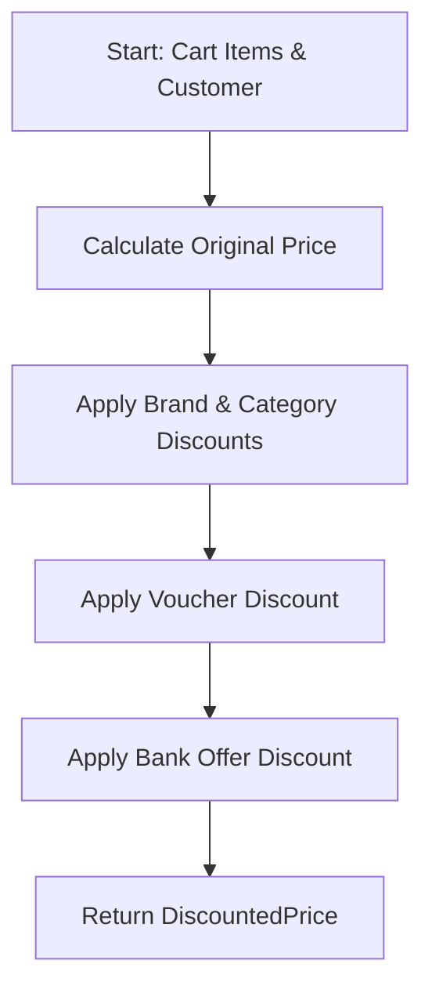

# Discount Service

A lightweight discount‐calculation engine for a fashion e-commerce platform.  
It demonstrates how to apply multiple, overlapping promotions in a clear, deterministic order while remaining easy to extend and test.

---

## 1. Features

• Handles four promotion types out-of-the-box:  
  1. **Brand offers** – e.g. "Min 40 % off on PUMA"  
  2. **Category deals** – e.g. "Extra 10 % off on T-shirts"  
  3. **Voucher codes** – e.g. "SUPER69" (69 % off)  
  4. **Bank-card discounts** – e.g. "10 % instant discount on ICICI cards"  
• Stacks all applicable discounts in the required order (brand → category → voucher → bank).  
• Returns a detailed breakdown (`DiscountedPrice`) so the UI can show "You saved…" messages.  
• Complete **type hints**, **unit tests**, and **integration test** for the happy-path scenario requested in the assignment.

---

## 2. Discount-Application Flow



Behind the scenes each step is implemented as a small, single-responsibility method in `DiscountService`, making the flow easy to follow and extend.

---

## 3. Project Structure

```
discount_service/
├── discount_service.py        # Core business logic
├── models.py                  # Data models supplied by assignment
├── fake_data.py               # Dummy data for testing
├── tests/
│   ├── test_unit_discount_service.py      # Unit tests (individual methods)
│   └── test_integration_discount_service.py # End-to-end happy path
└── README.md
```

---

## 4. Getting Started

### 4.1 Create a virtual environment
```bash
python3 -m venv env
source env/bin/activate
```

### 4.2 Install dependencies

pip install -r requirements.txt
```

### 4.3 Run the test-suite
```bash
pytest -v
```
You should see all unit tests (logic) and the integration test (happy path) pass.

---

## 5. Running the Example Scenario
The integration test models a cart that contains:

* 2× **PUMA T-Shirts** – brand promo "Min 40 % off"
* 1× **Nike Shoes** – brand promo "30 % off on Nike"
* 1× **Adidas Jeans** – category promo "15 % off on Jeans"
* Paid with an **ICICI Credit Card** – bank promo "10 % instant discount"

Running the test prints the original price, every applied discount, and the final payable amount.

---

## 6. Assumptions & Technical Decisions

1. `Product.current_price` may already include static markdowns; category-level discounts are applied on this value, brand-level on `base_price`.
2. Only **one voucher code** can be applied per transaction (common e-commerce rule).
3. All discount types **stack** – there are no mutual exclusions in this demo.
4. The solution purposefully focuses on the **happy path**; edge-case handling (e.g. expired vouchers) can be added the same way via new validation rules.

---

## 7. Extending the Engine

Adding a new promotion type is as simple as:
1. Define its rule in a configuration dict (similar to `BRAND_DISCOUNTS`).
2. Add a small helper method that calculates its amount.
3. Plug that method into the orchestration order in `calculate_cart_discounts`.

Because each calculator is unit-tested in isolation, the new rule can be validated with minimal effort.

---


